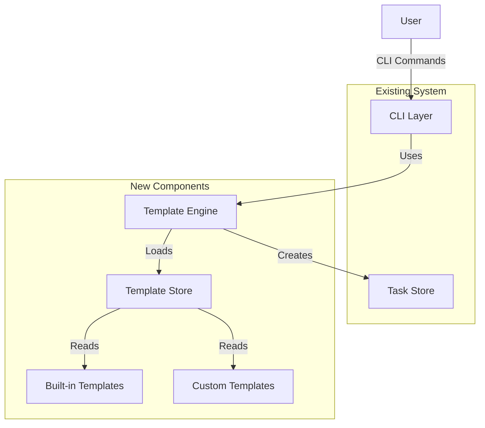
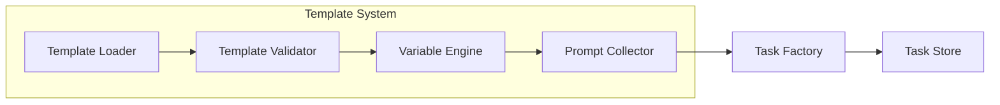
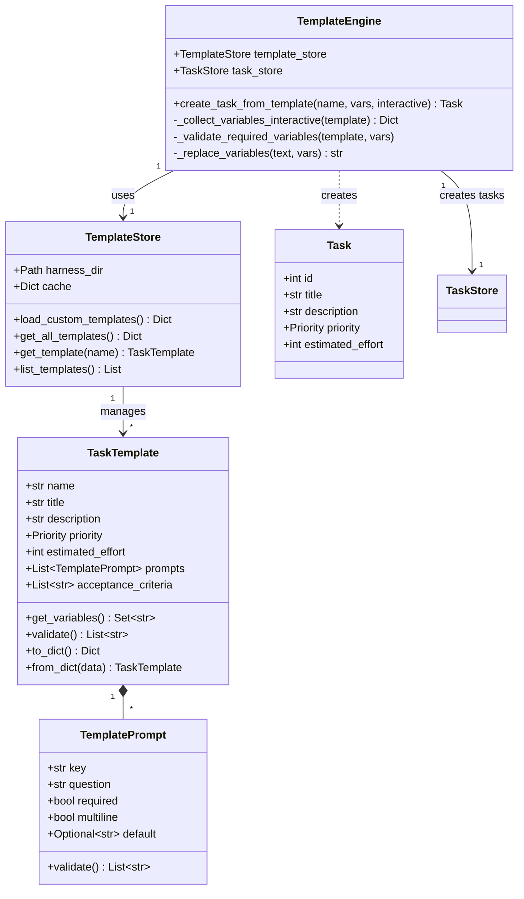

# Task Template System - Technical Design Document

**Version**: 1.0  
**Created**: 2026-06-05  
**Status**: Draft

---

## Overview

### Purpose

The Task Template System enables rapid creation of standardized tasks in the Harness MVP by providing:
- 3 built-in templates (feature, bugfix, refactor)
- Variable replacement mechanism for customization
- CLI integration for seamless workflow
- Custom template support for extensibility

### Goals

1. Reduce task creation time by 70% for common task types
2. Ensure consistency across task descriptions and structure
3. Enable non-intrusive integration with existing CLI commands
4. Provide extensibility through custom user templates

### Scope

**In Scope**:
- Template data model and storage format
- Template loading and validation engine
- Variable extraction and replacement logic
- CLI command integration (`harness plan add --template`, `harness template list/show`)
- Built-in templates (feature, bugfix, refactor)
- Custom template support (.harness/templates/)

**Out of Scope**:
- Template marketplace/sharing
- AI-generated templates
- Graphical template editor
- Template version control
- Template inheritance

---

## Architecture

### System Context



### Component Architecture



### Module Structure

```
harness/
├── templates.py          # NEW: Template engine and data models
├── template_loader.py    # NEW: Template loading and validation
├── models.py            # EXISTING: Task, Priority, etc.
├── store.py             # EXISTING: TaskStore
├── cli.py               # MODIFIED: Add template commands
└── prompts.py           # EXISTING: Shared prompting utilities

.harness/
└── templates/           # NEW: User custom templates
    ├── documentation.json
    └── api.json
```

---

## Components and Interfaces

### 1. Template Data Model (`templates.py`)

#### TaskTemplate Class

```python
@dataclass
class TemplatePrompt:
    """Represents a template variable prompt configuration"""
    key: str                    # Variable name (e.g., "feature_name")
    question: str               # Prompt text for user
    required: bool = True       # Whether input is mandatory
    multiline: bool = False     # Whether to accept multi-line input
    default: Optional[str] = None  # Default value if not provided
    
    def validate(self) -> List[str]:
        """Validate prompt configuration"""
        errors = []
        if not self.key or not self.key.strip():
            errors.append("Prompt key cannot be empty")
        if not re.match(r'^[a-zA-Z_][a-zA-Z0-9_]*$', self.key):
            errors.append(f"Invalid key '{self.key}': must be valid identifier")
        if not self.question or not self.question.strip():
            errors.append(f"Question for '{self.key}' cannot be empty")
        return errors


@dataclass
class TaskTemplate:
    """Represents a task template"""
    name: str                          # Template identifier
    title: str                         # Task title with variables
    description: str                   # Task description with variables
    priority: Priority                 # Default priority
    estimated_effort: int              # Default effort (1-5)
    prompts: List[TemplatePrompt]      # Variable prompts
    acceptance_criteria: List[str] = field(default_factory=list)
    
    def get_variables(self) -> Set[str]:
        """Extract all {variable} placeholders from title and description"""
        pattern = r'\{([a-zA-Z_][a-zA-Z0-9_]*)\}'
        variables = set()
        variables.update(re.findall(pattern, self.title))
        variables.update(re.findall(pattern, self.description))
        return variables
    
    def validate(self) -> List[str]:
        """Validate template structure and consistency"""
        errors = []
        
        # Validate required fields
        if not self.name or not self.name.strip():
            errors.append("Template name cannot be empty")
        if not re.match(r'^[a-zA-Z0-9_-]+$', self.name):
            errors.append(f"Invalid name '{self.name}': use only letters, numbers, _, -")
        
        if not self.title or not self.title.strip():
            errors.append("Template title cannot be empty")
        
        if not self.description or not self.description.strip():
            errors.append("Template description cannot be empty")
        
        # Validate effort range
        if not (1 <= self.estimated_effort <= 5):
            errors.append(f"Estimated effort must be 1-5, got {self.estimated_effort}")
        
        # Validate prompts
        if not self.prompts:
            errors.append("Template must have at least one prompt")
        
        prompt_keys = set()
        for prompt in self.prompts:
            errors.extend(prompt.validate())
            if prompt.key in prompt_keys:
                errors.append(f"Duplicate prompt key: {prompt.key}")
            prompt_keys.add(prompt.key)
        
        # Validate variable consistency
        template_vars = self.get_variables()
        prompt_keys_set = {p.key for p in self.prompts}
        
        undefined_vars = template_vars - prompt_keys_set
        if undefined_vars:
            errors.append(f"Variables not defined in prompts: {undefined_vars}")
        
        unused_prompts = prompt_keys_set - template_vars
        if unused_prompts:
            errors.append(f"Warning: Prompts not used in template: {unused_prompts}")
        
        return errors
    
    def to_dict(self) -> Dict[str, Any]:
        """Serialize to dictionary for JSON storage"""
        return {
            "name": self.name,
            "title": self.title,
            "description": self.description,
            "priority": self.priority.value,
            "estimated_effort": self.estimated_effort,
            "acceptance_criteria": self.acceptance_criteria,
            "prompts": [
                {
                    "key": p.key,
                    "question": p.question,
                    "required": p.required,
                    "multiline": p.multiline,
                    "default": p.default
                }
                for p in self.prompts
            ]
        }
    
    @classmethod
    def from_dict(cls, data: Dict[str, Any]) -> "TaskTemplate":
        """Deserialize from dictionary"""
        prompts = [
            TemplatePrompt(
                key=p["key"],
                question=p["question"],
                required=p.get("required", True),
                multiline=p.get("multiline", False),
                default=p.get("default")
            )
            for p in data.get("prompts", [])
        ]
        
        return cls(
            name=data["name"],
            title=data["title"],
            description=data["description"],
            priority=Priority.from_string(data.get("priority", "REQUIRED")),
            estimated_effort=data.get("estimated_effort", 1),
            prompts=prompts,
            acceptance_criteria=data.get("acceptance_criteria", [])
        )
```

### 2. Template Store (`template_loader.py`)

```python
class TemplateStore:
    """Manages loading and caching of templates"""
    
    def __init__(self, harness_dir: Path):
        self.harness_dir = harness_dir
        self.custom_template_dir = harness_dir / "templates"
        self._cache: Dict[str, TaskTemplate] = {}
        self._built_in_templates: Dict[str, TaskTemplate] = {}
        self._load_built_in_templates()
    
    def _load_built_in_templates(self):
        """Load built-in templates from code"""
        # Feature template
        feature = TaskTemplate(
            name="feature",
            title="实现 {feature_name} 功能",
            description="""### 功能描述
{description}

### 实现要点
- 设计数据模型
- 实现核心逻辑
- 编写单元测试
- 更新文档

### 验收标准
- [ ] 功能正常工作
- [ ] 测试覆盖率 >= 80%
- [ ] 代码审查通过""",
            priority=Priority.REQUIRED,
            estimated_effort=3,
            prompts=[
                TemplatePrompt("feature_name", "请输入功能名称", required=True),
                TemplatePrompt("description", "请输入功能描述", required=True, multiline=True)
            ]
        )
        
        # Bugfix template
        bugfix = TaskTemplate(
            name="bugfix",
            title="修复 {bug_description}",
            description="""### Bug 描述
{description}

### 复现步骤
{reproduction_steps}

### 修复方案
{fix_plan}""",
            priority=Priority.REQUIRED,
            estimated_effort=2,
            prompts=[
                TemplatePrompt("bug_description", "请输入Bug简短描述", required=True),
                TemplatePrompt("description", "请输入详细Bug描述", required=True, multiline=True),
                TemplatePrompt("reproduction_steps", "请输入复现步骤", required=True, multiline=True),
                TemplatePrompt("fix_plan", "请输入修复方案", required=False, multiline=True, default="待分析")
            ]
        )
        
        # Refactor template
        refactor = TaskTemplate(
            name="refactor",
            title="重构 {module_name}",
            description="""### 重构目标
{goal}

### 重构范围
{scope}

### 验收标准
- [ ] 功能行为不变
- [ ] 测试全部通过
- [ ] 代码质量提升""",
            priority=Priority.RECOMMENDED,
            estimated_effort=3,
            prompts=[
                TemplatePrompt("module_name", "请输入模块名称", required=True),
                TemplatePrompt("goal", "请输入重构目标", required=True, multiline=True),
                TemplatePrompt("scope", "请输入重构范围", required=True, multiline=True)
            ]
        )
        
        self._built_in_templates = {
            "feature": feature,
            "bugfix": bugfix,
            "refactor": refactor
        }
    
    def load_custom_templates(self) -> Dict[str, TaskTemplate]:
        """Load custom templates from .harness/templates/"""
        if not self.custom_template_dir.exists():
            return {}
        
        custom = {}
        for json_file in self.custom_template_dir.glob("*.json"):
            try:
                with open(json_file, 'r', encoding='utf-8') as f:
                    data = json.load(f)
                template = TaskTemplate.from_dict(data)
                
                # Validate
                errors = template.validate()
                if errors:
                    logger.warning(f"Template {json_file.name} has errors: {errors}")
                    continue
                
                custom[template.name] = template
            except Exception as e:
                logger.error(f"Failed to load template {json_file}: {e}")
        
        return custom
    
    def get_all_templates(self) -> Dict[str, TaskTemplate]:
        """Get all templates (custom templates override built-in)"""
        templates = dict(self._built_in_templates)
        custom = self.load_custom_templates()
        templates.update(custom)  # Custom templates can override built-in
        return templates
    
    def get_template(self, name: str) -> Optional[TaskTemplate]:
        """Get specific template by name"""
        templates = self.get_all_templates()
        return templates.get(name)
    
    def list_templates(self) -> List[Tuple[str, TaskTemplate, bool]]:
        """List all templates with (name, template, is_custom) tuples"""
        built_in = {name: (name, template, False) 
                    for name, template in self._built_in_templates.items()}
        custom = {name: (name, template, True) 
                  for name, template in self.load_custom_templates().items()}
        
        # Merge, with custom overriding built-in
        result = dict(built_in)
        result.update(custom)
        return list(result.values())
```

### 3. Template Engine (`templates.py`)

```python
class TemplateEngine:
    """Orchestrates template-based task creation"""
    
    def __init__(self, template_store: TemplateStore, task_store: TaskStore):
        self.template_store = template_store
        self.task_store = task_store
    
    def create_task_from_template(
        self,
        template_name: str,
        variables: Optional[Dict[str, str]] = None,
        interactive: bool = True
    ) -> Task:
        """Create a task from template
        
        Args:
            template_name: Name of template to use
            variables: Pre-provided variable values (for non-interactive mode)
            interactive: Whether to prompt user for missing variables
        
        Returns:
            Created Task object
        
        Raises:
            TemplateNotFoundError: If template doesn't exist
            TemplateValidationError: If template is invalid
            MissingVariableError: If required variables not provided in non-interactive mode
        """
        # Load template
        template = self.template_store.get_template(template_name)
        if not template:
            raise TemplateNotFoundError(f"Template '{template_name}' not found")
        
        # Validate template
        errors = template.validate()
        if errors:
            raise TemplateValidationError(f"Template validation failed: {errors}")
        
        # Collect variable values
        if interactive:
            var_values = self._collect_variables_interactive(template)
        else:
            var_values = variables or {}
            self._validate_required_variables(template, var_values)
        
        # Replace variables in title and description
        title = self._replace_variables(template.title, var_values)
        description = self._replace_variables(template.description, var_values)
        
        # Create task
        task_id = self.task_store.get_next_task_id()
        task = Task(
            id=task_id,
            title=title,
            description=description,
            priority=template.priority,
            estimated_effort=template.estimated_effort,
            acceptance_criteria=template.acceptance_criteria.copy()
        )
        
        return task
    
    def _collect_variables_interactive(self, template: TaskTemplate) -> Dict[str, str]:
        """Prompt user for variable values interactively"""
        values = {}
        
        click.echo(f"\n✨ 使用模板: {template.name}\n")
        
        for prompt in template.prompts:
            if prompt.multiline:
                click.echo(f"{prompt.question} (多行输入，按 Ctrl+D 或 Ctrl+Z 结束):")
                lines = []
                try:
                    while True:
                        line = input("> ")
                        lines.append(line)
                except EOFError:
                    pass
                value = "\n".join(lines)
            else:
                if prompt.default:
                    value = click.prompt(
                        prompt.question,
                        default=prompt.default,
                        show_default=True
                    )
                else:
                    value = click.prompt(prompt.question)
            
            # Validate required
            if prompt.required and not value.strip():
                if prompt.default:
                    value = prompt.default
                else:
                    raise MissingVariableError(f"Required variable '{prompt.key}' cannot be empty")
            
            values[prompt.key] = value.strip()
        
        return values
    
    def _validate_required_variables(
        self, 
        template: TaskTemplate, 
        variables: Dict[str, str]
    ):
        """Validate that all required variables are provided"""
        required_keys = {p.key for p in template.prompts if p.required}
        provided_keys = set(variables.keys())
        missing = required_keys - provided_keys
        
        if missing:
            raise MissingVariableError(f"Missing required variables: {missing}")
    
    def _replace_variables(self, text: str, variables: Dict[str, str]) -> str:
        """Replace {variable} placeholders with actual values"""
        result = text
        for key, value in variables.items():
            placeholder = f"{{{key}}}"
            result = result.replace(placeholder, value)
        return result


class TemplateNotFoundError(Exception):
    pass

class TemplateValidationError(Exception):
    pass

class MissingVariableError(Exception):
    pass
```

### 4. CLI Integration (`cli.py`)

```python
# Add to existing cli.py

@plan.command()
@click.option('--template', '-t', help="模板名称 (feature, bugfix, refactor)")
@click.option('--var', 'variables', multiple=True, help="变量值 (格式: key=value)")
@click.option('--title', help="任务标题")
@click.option('--description', '-d', help="任务描述")
@click.option('--priority', '-p', type=click.Choice(['REQUIRED', 'RECOMMENDED', 'OPTIONAL']), default='REQUIRED')
@click.option('--estimate', '-e', type=int, default=1, help="估算工作量 (1-5)")
def add(template: str, variables, title: str, description: str, priority: str, estimate: int):
    """添加新任务（支持模板或手动输入）"""
    harness_dir = get_harness_dir()
    task_store = TaskStore(harness_dir)
    history = HistoryManager(harness_dir)
    
    if template:
        # Template mode
        template_store = TemplateStore(harness_dir)
        engine = TemplateEngine(template_store, task_store)
        
        # Parse variables
        var_dict = {}
        for var in variables:
            if '=' not in var:
                click.echo(f"错误: 无效的变量格式 '{var}'，应为 key=value")
                return
            key, value = var.split('=', 1)
            var_dict[key.strip()] = value.strip()
        
        # Interactive mode if no variables provided
        interactive = len(var_dict) == 0
        
        try:
            task = engine.create_task_from_template(
                template,
                variables=var_dict,
                interactive=interactive
            )
            task_store.add_task(task)
            history.log_task_created(task)
            
            click.echo(f"\n✅ 任务创建成功! (ID: {task.id})")
            click.echo(f"   标题: {task.title}")
            click.echo(f"   优先级: {task.priority.value}")
            click.echo(f"   工作量: {task.estimated_effort}")
            
        except TemplateNotFoundError as e:
            click.echo(f"❌ 错误: {e}")
            click.echo("\n可用模板:")
            for name, tmpl, is_custom in template_store.list_templates():
                suffix = " (自定义)" if is_custom else ""
                click.echo(f"  - {name}{suffix}")
        except (TemplateValidationError, MissingVariableError) as e:
            click.echo(f"❌ 错误: {e}")
    else:
        # Original manual mode
        if not title:
            title = click.prompt("任务标题")
            description = click.prompt("任务描述（可选）", default="")
            priority = click.prompt("优先级", type=click.Choice(['REQUIRED', 'RECOMMENDED', 'OPTIONAL']), default='REQUIRED')
            estimate = click.prompt("估算工作量 (1-5)", type=int, default=1)
        
        task_id = task_store.get_next_task_id()
        task = Task(
            id=task_id,
            title=title,
            description=description,
            priority=Priority.from_string(priority),
            estimated_effort=estimate
        )
        
        task_store.add_task(task)
        history.log_task_created(task)
        
        click.echo(f"已添加任务 #{task_id}: {task.title}")


@main.group()
def template():
    """模板管理命令"""
    pass


@template.command('list')
def list_templates():
    """列出所有可用模板"""
    harness_dir = get_harness_dir()
    template_store = TemplateStore(harness_dir)
    
    templates = template_store.list_templates()
    
    if not templates:
        click.echo("没有可用的模板。")
        return
    
    click.echo("\n可用模板:\n")
    for name, tmpl, is_custom in templates:
        suffix = " (自定义)" if is_custom else ""
        desc_preview = tmpl.description.split('\n')[0][:50]
        click.echo(f"  {name}{suffix}")
        click.echo(f"    {desc_preview}...")
        click.echo(f"    优先级: {tmpl.priority.value}, 工作量: {tmpl.estimated_effort}")
    
    click.echo("\n使用方式: harness plan add --template <template_name>")


@template.command('show')
@click.argument('template_name')
def show_template(template_name: str):
    """显示模板详情"""
    harness_dir = get_harness_dir()
    template_store = TemplateStore(harness_dir)
    
    tmpl = template_store.get_template(template_name)
    if not tmpl:
        click.echo(f"模板 '{template_name}' 不存在。")
        return
    
    click.echo(f"\n=== 模板: {tmpl.name} ===\n")
    click.echo(f"标题: {tmpl.title}")
    click.echo(f"优先级: {tmpl.priority.value}")
    click.echo(f"工作量: {tmpl.estimated_effort}")
    click.echo(f"\n描述:\n{tmpl.description}\n")
    
    if tmpl.prompts:
        click.echo("变量:")
        for p in tmpl.prompts:
            required = "必填" if p.required else "可选"
            multiline = "（多行）" if p.multiline else ""
            default = f" [默认: {p.default}]" if p.default else ""
            click.echo(f"  - {p.key} ({required}){multiline}{default}: {p.question}")
```

---

## Data Models

### Template Storage Format (JSON)

```json
{
  "name": "feature",
  "title": "实现 {feature_name} 功能",
  "description": "### 功能描述\n{description}\n\n### 实现要点\n...",
  "priority": "REQUIRED",
  "estimated_effort": 3,
  "acceptance_criteria": [
    "功能正常工作",
    "测试覆盖率 >= 80%",
    "代码审查通过"
  ],
  "prompts": [
    {
      "key": "feature_name",
      "question": "请输入功能名称",
      "required": true,
      "multiline": false,
      "default": null
    },
    {
      "key": "description",
      "question": "请输入功能描述",
      "required": true,
      "multiline": true,
      "default": null
    }
  ]
}
```

### Class Diagram



---

## Correctness Properties

*A property is a characteristic or behavior that should hold true across all valid executions of a system—essentially, a formal statement about what the system should do. Properties serve as the bridge between human-readable specifications and machine-verifiable correctness guarantees.*

### Property 1: Variable Extraction Completeness

*For any* template text containing `{variable}` placeholders, the `get_variables()` method SHALL extract all and only the valid variable identifiers matching the pattern `{[a-zA-Z_][a-zA-Z0-9_]*}`.

**Validates: Requirements 3.2.1**

### Property 2: Variable Replacement Correctness

*For any* template text and any mapping of variable names to values, the `_replace_variables()` method SHALL replace all occurrences of `{variable}` with the corresponding value, and the result SHALL NOT contain any placeholders present in the original mapping.

**Validates: Requirements 3.2.2**

### Property 3: Required Field Validation

*For any* template with required prompts, validation SHALL fail if empty or whitespace-only values are provided for required fields, and validation SHALL succeed if all required fields have non-empty values.

**Validates: Requirements 3.2.3**

### Property 4: Template Serialization Round-Trip

*For any* valid TaskTemplate object, serializing to dictionary via `to_dict()` and then deserializing via `from_dict()` SHALL produce a template equivalent to the original.

**Validates: Requirements 3.2.4**

### Property 5: Template Name Validation

*For any* string, the template name validation SHALL accept only strings matching `^[a-zA-Z0-9_-]+$` and reject all other strings.

**Validates: Requirements 3.5.1**

### Property 6: Template Field Type Validation

*For any* template data, validation SHALL ensure priority is a valid Priority enum value, estimated_effort is an integer in range [1,5], and prompts is a non-empty list.

**Validates: Requirements 3.5.2**

### Property 7: Variable-Prompt Consistency

*For any* template, validation SHALL ensure that the set of variables in the template text is a subset of (or equal to) the set of prompt keys defined in the prompts list.

**Validates: Requirements 3.5.3**

### Property 8: Custom Template Loading Preservation

*For any* valid template JSON file in `.harness/templates/`, loading the file SHALL produce a TaskTemplate object that, when serialized back to JSON, contains the same semantic content (allowing for formatting differences).

**Validates: Requirements 3.4.1**

---

## Error Handling

### Error Categories

1. **Template Not Found** (`TemplateNotFoundError`)
   - Raised when requested template doesn't exist
   - User-facing message: "Template 'X' not found. Available templates: [list]"

2. **Template Validation Error** (`TemplateValidationError`)
   - Raised when template structure is invalid
   - User-facing message: "Template validation failed: [specific errors]"
   - Includes detailed list of validation failures

3. **Missing Variable Error** (`MissingVariableError`)
   - Raised in non-interactive mode when required variables not provided
   - User-facing message: "Missing required variables: {var1, var2}"

4. **JSON Parse Error**
   - Raised when custom template file is not valid JSON
   - User-facing message: "Failed to load template from 'X.json': Invalid JSON format"

5. **File System Error**
   - Raised when template file cannot be read
   - User-facing message: "Cannot read template file 'X.json': [reason]"

### Error Handling Strategy

1. **Fail Fast on Invalid Templates**
   - Validate templates immediately on load
   - Log warnings for invalid custom templates but continue with valid ones
   - Never use an invalid template for task creation

2. **Graceful Degradation**
   - If custom template directory doesn't exist, fall back to built-in templates
   - If custom template is invalid, skip it and show warning

3. **User-Friendly Messages**
   - Show concrete examples of valid formats in error messages
   - Suggest fixes when possible (e.g., "Did you mean 'feature'?")
   - For validation errors, list all issues at once (not just first failure)

4. **Logging**
   - Log all template loading operations at DEBUG level
   - Log validation failures at WARNING level
   - Log successful task creation at INFO level

### Error Recovery

```python
# Example: Template loading with error recovery
def load_custom_templates(self) -> Dict[str, TaskTemplate]:
    """Load custom templates with error recovery"""
    if not self.custom_template_dir.exists():
        logger.debug("Custom template directory doesn't exist, using built-in only")
        return {}
    
    custom = {}
    errors = []
    
    for json_file in self.custom_template_dir.glob("*.json"):
        try:
            template = self._load_template_file(json_file)
            validation_errors = template.validate()
            
            if validation_errors:
                errors.append(f"{json_file.name}: {', '.join(validation_errors)}")
                continue
            
            custom[template.name] = template
            logger.info(f"Loaded custom template: {template.name}")
            
        except json.JSONDecodeError as e:
            errors.append(f"{json_file.name}: Invalid JSON at line {e.lineno}")
        except Exception as e:
            errors.append(f"{json_file.name}: {str(e)}")
    
    if errors:
        logger.warning(f"Failed to load {len(errors)} custom templates:\n" + 
                      "\n".join(f"  - {e}" for e in errors))
    
    return custom
```

---

## Testing Strategy

### Unit Testing

**Scope**: Individual functions and methods in isolation

**Test Coverage Requirements**:
- Minimum 80% code coverage
- All error paths tested
- Edge cases for validation rules

**Unit Test Categories**:

1. **Template Data Model Tests**
   - `test_template_validate_valid()` - Valid templates pass validation
   - `test_template_validate_missing_name()` - Rejects empty name
   - `test_template_validate_invalid_name()` - Rejects invalid characters
   - `test_template_validate_invalid_effort()` - Rejects effort outside 1-5
   - `test_template_validate_missing_prompts()` - Rejects templates without prompts
   - `test_template_get_variables()` - Extracts variables correctly
   - `test_template_to_dict()` - Serialization works
   - `test_template_from_dict()` - Deserialization works

2. **Template Store Tests**
   - `test_load_built_in_templates()` - All 3 built-in templates loaded
   - `test_load_custom_templates()` - Custom templates loaded from directory
   - `test_custom_template_override()` - Custom overrides built-in
   - `test_get_template_not_found()` - Returns None for missing template
   - `test_list_templates()` - Lists all templates with metadata

3. **Template Engine Tests**
   - `test_create_task_basic()` - Creates task with provided variables
   - `test_create_task_template_not_found()` - Raises TemplateNotFoundError
   - `test_create_task_missing_required_var()` - Raises MissingVariableError
   - `test_replace_variables()` - Variable replacement works correctly
   - `test_validate_required_variables()` - Validation enforces required fields

4. **CLI Integration Tests**
   - `test_plan_add_with_template()` - Command creates task from template
   - `test_plan_add_with_variables()` - Non-interactive mode with --var
   - `test_template_list()` - Lists all templates
   - `test_template_show()` - Shows template details

### Property-Based Testing

**Library**: Hypothesis (Python)

**Configuration**: Minimum 100 iterations per property test

**Property Test Implementation**:

```python
from hypothesis import given, strategies as st
import hypothesis.strategies as st

# Strategy for generating valid variable names
valid_var_names = st.text(
    alphabet=st.characters(whitelist_categories=('Lu', 'Ll', 'Nd'), whitelist_characters='_'),
    min_size=1
).filter(lambda s: s[0] in 'abcdefghijklmnopqrstuvwxyzABCDEFGHIJKLMNOPQRSTUVWXYZ_')

# Strategy for template text with variables
@st.composite
def template_text_strategy(draw):
    """Generate template text with embedded variables"""
    num_vars = draw(st.integers(min_value=0, max_value=5))
    var_names = [draw(valid_var_names) for _ in range(num_vars)]
    
    parts = [draw(st.text(max_size=50))]
    for var_name in var_names:
        parts.append(f"{{{var_name}}}")
        parts.append(draw(st.text(max_size=50)))
    
    return "".join(parts), set(var_names)

@given(template_text_strategy())
def test_property_variable_extraction(template_and_vars):
    """Property 1: Variable extraction completeness
    
    Feature: task-template-system, Property 1: For any template text containing 
    {variable} placeholders, get_variables() SHALL extract all and only the 
    valid variable identifiers
    """
    template_text, expected_vars = template_and_vars
    
    # Create a minimal template
    template = TaskTemplate(
        name="test",
        title=template_text,
        description="",
        priority=Priority.REQUIRED,
        estimated_effort=1,
        prompts=[]
    )
    
    extracted_vars = template.get_variables()
    assert extracted_vars == expected_vars

@given(
    template_text_strategy(),
    st.dictionaries(valid_var_names, st.text(min_size=1, max_size=50))
)
def test_property_variable_replacement(template_and_vars, var_values):
    """Property 2: Variable replacement correctness
    
    Feature: task-template-system, Property 2: For any template text and any 
    mapping of variables to values, _replace_variables() SHALL replace all 
    occurrences and result SHALL NOT contain placeholders from the mapping
    """
    template_text, var_names = template_and_vars
    engine = TemplateEngine(None, None)
    
    # Filter var_values to only include variables in template
    relevant_vars = {k: v for k, v in var_values.items() if k in var_names}
    
    result = engine._replace_variables(template_text, relevant_vars)
    
    # Check that all replaced variables don't appear as placeholders
    for var_name in relevant_vars.keys():
        assert f"{{{var_name}}}" not in result

@given(
    st.text(alphabet=st.characters(whitelist_categories=('Lu', 'Ll', 'Nd'), 
                                   whitelist_characters='_-'), 
            min_size=0, max_size=50)
)
def test_property_template_name_validation(name):
    """Property 5: Template name validation
    
    Feature: task-template-system, Property 5: For any string, template name 
    validation SHALL accept only strings matching ^[a-zA-Z0-9_-]+$ pattern
    """
    # Valid pattern
    is_valid_pattern = bool(re.match(r'^[a-zA-Z0-9_-]+$', name)) and len(name) > 0
    
    # Create template with this name
    template = TaskTemplate(
        name=name,
        title="Test",
        description="Test",
        priority=Priority.REQUIRED,
        estimated_effort=1,
        prompts=[TemplatePrompt("var", "Question")]
    )
    
    errors = template.validate()
    has_name_error = any("Invalid name" in e or "name cannot be empty" in e 
                         for e in errors)
    
    assert (not is_valid_pattern) == has_name_error

@given(st.builds(
    TaskTemplate,
    name=valid_var_names,
    title=st.text(min_size=1, max_size=100),
    description=st.text(min_size=1, max_size=500),
    priority=st.sampled_from(list(Priority)),
    estimated_effort=st.integers(min_value=1, max_value=5),
    prompts=st.lists(
        st.builds(
            TemplatePrompt,
            key=valid_var_names,
            question=st.text(min_size=1, max_size=100),
            required=st.booleans(),
            multiline=st.booleans(),
            default=st.one_of(st.none(), st.text(max_size=50))
        ),
        min_size=1,
        max_size=5
    ),
    acceptance_criteria=st.lists(st.text(min_size=1, max_size=100))
))
def test_property_template_round_trip(template):
    """Property 4: Template serialization round-trip
    
    Feature: task-template-system, Property 4: For any valid TaskTemplate, 
    serializing to dict and deserializing SHALL produce equivalent template
    """
    # Serialize
    data = template.to_dict()
    
    # Deserialize
    restored = TaskTemplate.from_dict(data)
    
    # Check equivalence
    assert restored.name == template.name
    assert restored.title == template.title
    assert restored.description == template.description
    assert restored.priority == template.priority
    assert restored.estimated_effort == template.estimated_effort
    assert len(restored.prompts) == len(template.prompts)
    
    for orig_prompt, restored_prompt in zip(template.prompts, restored.prompts):
        assert restored_prompt.key == orig_prompt.key
        assert restored_prompt.question == orig_prompt.question
        assert restored_prompt.required == orig_prompt.required
        assert restored_prompt.multiline == orig_prompt.multiline
        assert restored_prompt.default == orig_prompt.default
```

**Additional Property Tests**:
- Property 3: Required field validation (generate templates with various required/optional fields, test validation)
- Property 6: Field type validation (generate templates with valid/invalid field types)
- Property 7: Variable-prompt consistency (generate templates with matching/mismatching variables and prompts)
- Property 8: Custom template loading (generate valid JSON templates, verify round-trip through file system)

### Integration Testing

**Scope**: End-to-end workflows

1. **Template-Based Task Creation**
   - Create task using feature template with interactive prompts
   - Create task using bugfix template with --var parameters
   - Verify task is saved to task store with correct attributes

2. **Custom Template Workflow**
   - Create custom template JSON file
   - Verify it appears in `harness template list`
   - Use it to create a task
   - Verify task created correctly

3. **Template Override**
   - Create custom template with same name as built-in
   - Verify custom template is used instead of built-in

4. **Error Scenarios**
   - Attempt to use non-existent template
   - Attempt to create task with missing required variables in non-interactive mode
   - Load invalid JSON template file

### Test Execution

**Test Command**:
```bash
# Run all tests
pytest tests/

# Run unit tests only
pytest tests/test_templates.py

# Run property-based tests with verbose output
pytest tests/test_template_properties.py -v

# Run with coverage
pytest --cov=harness --cov-report=html
```

**Continuous Integration**:
- Run full test suite on every commit
- Fail build if coverage drops below 80%
- Run property tests with 100 iterations in CI

---

## Implementation Plan

### Phase 1: Core Data Models (2 hours)
- Implement `TemplatePrompt` and `TaskTemplate` classes
- Implement validation logic
- Write unit tests for data models

### Phase 2: Template Storage (3 hours)
- Implement `TemplateStore` class
- Add built-in templates
- Implement custom template loading
- Write unit tests for template store

### Phase 3: Template Engine (3 hours)
- Implement `TemplateEngine` class
- Implement variable extraction and replacement
- Implement interactive prompt collection
- Write unit tests for template engine

### Phase 4: CLI Integration (2 hours)
- Modify `harness plan add` command
- Add `harness template list` command
- Add `harness template show` command
- Write CLI integration tests

### Phase 5: Property-Based Tests (2 hours)
- Set up Hypothesis framework
- Implement all 8 correctness properties as tests
- Configure test parameters (100 iterations minimum)

### Phase 6: Documentation & Polish (1 hour)
- Update README with template usage examples
- Add inline code comments
- Create user guide for custom templates

**Total Estimated Effort**: 13 hours

---

## Dependencies

### External Dependencies
- No new external dependencies required
- Uses existing dependencies: `click`, `dataclasses`, `json`, `pathlib`

### Internal Dependencies
- `harness.models.Task` - Existing task model
- `harness.models.Priority` - Existing priority enum
- `harness.store.TaskStore` - Existing task storage
- `harness.history.HistoryManager` - Existing event logging

### Development Dependencies
- `hypothesis` - Property-based testing framework (add to dev requirements)

---

## Performance Considerations

### Template Loading
- **Requirement**: Template loading < 100ms
- **Strategy**: 
  - Lazy load custom templates only when needed
  - Cache loaded templates in memory
  - Built-in templates are hardcoded (no file I/O)

### Task Creation
- **Requirement**: Task creation < 500ms (excluding user input)
- **Strategy**:
  - Variable replacement is O(n*m) where n=text length, m=number of variables
  - For typical templates (< 1KB) and few variables (< 10), this is negligible
  - No optimization needed for MVP

### Template Validation
- **Strategy**:
  - Validate once at load time, not on every use
  - Validation is O(n) in template size and number of prompts
  - Cache validation results

---

## Security Considerations

### Input Validation
- Template names: Only allow alphanumeric, underscore, hyphen
- Variable values: No restrictions (user-provided task content)
- JSON parsing: Use standard library (safe from injection)

### File System Access
- Custom templates: Only read from `.harness/templates/`
- No arbitrary file path access
- Fail gracefully if directory doesn't exist or is unreadable

### Code Injection
- Variable replacement is string substitution only
- No eval() or exec() of user-provided content
- Template JSON is data only, not code

---

## Future Enhancements

### Phase 2 Enhancements (Not in MVP)

1. **Conditional Logic**
   - Support conditional sections in templates
   - Example: Show "fix_plan" only if bug severity is "critical"

2. **Template Inheritance**
   - Base templates that other templates extend
   - Example: All "feature" variants inherit from base feature template

3. **Variable Validators**
   - Custom validation rules per variable (regex, min/max length, allowed values)
   - Example: Priority must be one of REQUIRED/RECOMMENDED/OPTIONAL

4. **Template Preview**
   - `harness template preview <name>` - Show what task will look like before creating

5. **Multi-language Support**
   - Template content in multiple languages
   - Auto-detect user language preference

---

## Appendix

### Example: Complete Feature Template Usage

```bash
# Terminal session
$ harness template list

可用模板:

  feature
    实现功能开发任务
    优先级: REQUIRED, 工作量: 3
  bugfix
    Bug修复任务
    优先级: REQUIRED, 工作量: 2
  refactor
    代码重构任务
    优先级: RECOMMENDED, 工作量: 3

使用方式: harness plan add --template <template_name>

$ harness plan add --template feature

✨ 使用模板: feature

请输入功能名称: 任务模板系统
请输入功能描述 (多行输入，按 Ctrl+D 或 Ctrl+Z 结束):
> 实现任务模板系统，支持快速创建标准化任务
> 包含内置模板和自定义模板能力
> ^D

✅ 任务创建成功! (ID: 10)
   标题: 实现 任务模板系统 功能
   优先级: REQUIRED
   工作量: 3

$ harness plan show 10

=== 任务 #10: 实现 任务模板系统 功能 ===

状态：TODO
优先级：REQUIRED
估算工作量：3

描述:
### 功能描述
实现任务模板系统，支持快速创建标准化任务
包含内置模板和自定义模板能力

### 实现要点
- 设计数据模型
- 实现核心逻辑
- 编写单元测试
- 更新文档

### 验收标准
- [ ] 功能正常工作
- [ ] 测试覆盖率 >= 80%
- [ ] 代码审查通过
```

### Example: Custom Template Creation

```bash
# Create custom template
$ mkdir -p .harness/templates
$ cat > .harness/templates/api.json << 'EOF'
{
  "name": "api",
  "title": "实现 {endpoint} API接口",
  "description": "### API 描述\n{description}\n\n### 请求方法\n{method}\n\n### 参数\n{params}",
  "priority": "REQUIRED",
  "estimated_effort": 2,
  "acceptance_criteria": [
    "API功能正常",
    "错误处理完善",
    "文档完整"
  ],
  "prompts": [
    {
      "key": "endpoint",
      "question": "请输入API端点",
      "required": true
    },
    {
      "key": "description",
      "question": "请输入API功能描述",
      "required": true,
      "multiline": true
    },
    {
      "key": "method",
      "question": "请输入HTTP方法 (GET/POST/PUT/DELETE)",
      "required": true,
      "default": "GET"
    },
    {
      "key": "params",
      "question": "请输入参数说明",
      "required": false,
      "multiline": true,
      "default": "无参数"
    }
  ]
}
EOF

# Verify template is loaded
$ harness template show api

=== 模板: api ===

标题: 实现 {endpoint} API接口
优先级: REQUIRED
工作量: 2

描述:
### API 描述
{description}

### 请求方法
{method}

### 参数
{params}

变量:
  - endpoint (必填): 请输入API端点
  - description (必填)（多行）: 请输入API功能描述
  - method (必填) [默认: GET]: 请输入HTTP方法 (GET/POST/PUT/DELETE)
  - params (可选)（多行） [默认: 无参数]: 请输入参数说明

# Use custom template
$ harness plan add --template api --var endpoint="/users/login" \
  --var description="用户登录接口" --var method="POST" \
  --var params="username, password"

✅ 任务创建成功! (ID: 11)
   标题: 实现 /users/login API接口
   优先级: REQUIRED
   工作量: 2
```

---

**Design Document Status**: ✅ Complete  
**Next Step**: Create tasks document (`tasks.md`)
