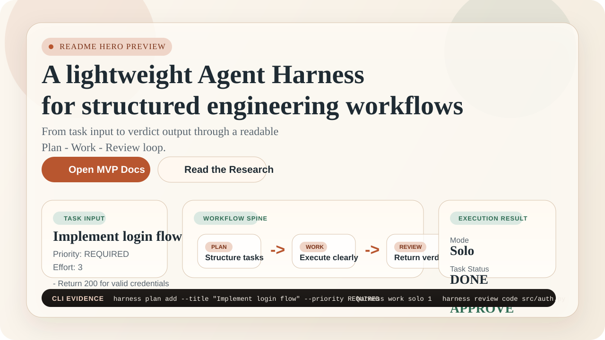

# Harness Engineering Study

[简体中文](./README.zh-CN.md)

An open repository for studying, documenting, and prototyping **Harness Engineering** workflows, with a runnable lightweight **Agent Harness MVP** built in Python.



## Why Star This Repo

This repository is designed to be useful in three different ways at once:

- **Research-backed**: it connects OpenAI, Anthropic, `claude-code-harness`, `refact`, and `agent-os` into one structured study surface
- **Runnable**: it includes a practical `Plan -> Work -> Review` MVP you can inspect and run locally
- **Different**: it uses an English-friendly discovery layer for GitHub visitors while keeping deeper Chinese content as its long-term learning moat

## Workflow Snapshot

The fastest way to understand this repository is to read it as one visible engineering loop:

### 1. Task Input

- start from a concrete task such as `Implement login flow`
- keep explicit acceptance criteria instead of vague agent goals
- make priority and effort readable before execution starts

### 2. Workflow Spine

- `Plan`: structure tasks and dependencies
- `Work`: execute in solo or parallel mode
- `Review`: return a verdict, not vague feedback

### 3. Execution Result

- mode stays visible: `Solo` or `Parallel`
- task status ends in something auditable like `DONE`
- review output stays structured enough to inspect and discuss

That is the core reason this project exists: to make Harness Engineering easier to study, compare, and try.

## CLI Evidence

The MVP is meant to feel inspectable, not magical:

```bash
harness plan add --title "Implement login flow" --priority REQUIRED
harness work solo 1
harness review code src/auth.py
```

This is the smallest useful story the repository wants to tell on first contact: task in, workflow visible, verdict out.

## Trust Signals

- Research is grounded in OpenAI, Anthropic, `claude-code-harness`, `refact`, and `agent-os`
- The repository includes a runnable Python MVP rather than theory-only notes
- Local verification on the MVP currently passes with `514` tests
- The repo uses an English discovery layer with deeper Chinese learning material underneath

## Quick Demo

If you want to validate the repository in under one minute, this is the shortest useful path:

### 1. Install the MVP locally

```bash
cd harness-mvp
pip install -e ".[dev]"
```

### 2. Create and execute one concrete task

```bash
harness plan add --title "Implement login flow" --priority REQUIRED
harness work solo 1
```

### 3. End with a visible review result

```bash
harness review code src/auth.py
```

What you should expect from this flow:

- a concrete task enters the system
- the harness loop becomes visible instead of staying abstract
- the run ends in a reviewable verdict rather than a black-box claim

For a more guided walkthrough, see [docs/quick-start.md](/E:/IDEWorkplaces/VS/harness-engineering-study/docs/quick-start.md).

## Why This Repo

Most discussions around Harness Engineering are scattered across essays, experiments, and framework-specific examples. This project brings them together in one place:

- Research on OpenAI, Anthropic, `claude-code-harness`, `refact`, and `agent-os`
- A practical `Plan -> Work -> Review` MVP you can run locally
- Chinese deep-dive documentation for developers who want more than marketing-level summaries
- A lightweight implementation that favors readability over infrastructure complexity

## What You Can Explore

### 1. Research

The repository includes structured notes and comparisons around:

- core Harness Engineering concepts
- design patterns and implementation trade-offs
- existing open-source harness projects
- practical lessons extracted from real systems

Start here:

- [research/README.md](/E:/IDEWorkplaces/VS/harness-engineering-study/research/README.md)
- [research/core-concepts.md](/E:/IDEWorkplaces/VS/harness-engineering-study/research/core-concepts.md)
- [research/comparison.md](/E:/IDEWorkplaces/VS/harness-engineering-study/research/comparison.md)

### 2. Runnable MVP

The MVP focuses on a minimal but useful loop:

- `plan`: manage tasks and acceptance criteria
- `work`: execute tasks in solo or parallel modes
- `review`: review code with multi-angle rules

Implementation entry points:

- [harness-mvp/README.md](/E:/IDEWorkplaces/VS/harness-engineering-study/harness-mvp/README.md)
- [design/mvp-architecture.md](/E:/IDEWorkplaces/VS/harness-engineering-study/design/mvp-architecture.md)

### 3. Chinese Deep Content

The deeper research and architecture documents are currently written primarily in Chinese. That is intentional: this repo aims to be a strong Chinese-language learning and practice resource, while keeping an English-friendly entry layer for GitHub discovery.

## Quick Start

### Read the research

```bash
cd research
```

Recommended reading order:

1. [research/core-concepts.md](/E:/IDEWorkplaces/VS/harness-engineering-study/research/core-concepts.md)
2. [research/key-insights.md](/E:/IDEWorkplaces/VS/harness-engineering-study/research/key-insights.md)
3. [research/comparison.md](/E:/IDEWorkplaces/VS/harness-engineering-study/research/comparison.md)

### Run the MVP

```bash
cd harness-mvp
pip install -e ".[dev]"
harness --help
```

Example flow:

```bash
harness plan add --title "Implement login" --priority REQUIRED
harness work solo 1
harness review code src/auth.py
```

## How This Repo Differs

| Dimension | Harness Engineering Study | Typical demo repo | Heavy framework |
| --- | --- | --- | --- |
| Research depth | High | Low | Medium |
| Runnable implementation | Yes | Sometimes | Yes |
| Learning readability | High | Medium | Often low |
| Scope honesty | Explicit MVP boundaries | Often vague | Powerful but complex |
| Bilingual strategy | English entry + Chinese depth | Usually absent | Usually absent |

## Repository Structure

```text
harness-engineering-study/
├── docs/          # project guides and user-facing documentation
├── design/        # architecture notes and MVP design docs
├── research/      # study notes, comparisons, and distilled insights
├── harness-mvp/   # runnable lightweight Agent Harness MVP
└── examples/      # example projects and usage samples
```

## Current Direction

This repository is being improved along two tracks:

1. Better GitHub-facing English entry points for discovery and adoption
2. Richer Chinese deep content for serious learners and practitioners

Near-term focus:

- clean English landing pages
- clearer document navigation
- better quick-start experience
- stronger demo and showcase materials

## Who This Is For

- Developers curious about Harness Engineering beyond buzzwords
- Builders who want a small, readable harness prototype
- Technical leads exploring structured AI-assisted development workflows
- Chinese-speaking learners who want systematic research material

## Documentation Map

- English entry:
  - [README.md](/E:/IDEWorkplaces/VS/harness-engineering-study/README.md)
  - [docs/quick-start.md](/E:/IDEWorkplaces/VS/harness-engineering-study/docs/quick-start.md)
  - [docs/api-reference.md](/E:/IDEWorkplaces/VS/harness-engineering-study/docs/api-reference.md)
  - [docs/roadmap.md](/E:/IDEWorkplaces/VS/harness-engineering-study/docs/roadmap.md)
  - [research/README.md](/E:/IDEWorkplaces/VS/harness-engineering-study/research/README.md)
  - [design/README.md](/E:/IDEWorkplaces/VS/harness-engineering-study/design/README.md)
- Chinese entry:
  - [README.zh-CN.md](/E:/IDEWorkplaces/VS/harness-engineering-study/README.zh-CN.md)
  - [docs/quick-start.zh-CN.md](/E:/IDEWorkplaces/VS/harness-engineering-study/docs/quick-start.zh-CN.md)
  - [docs/api-reference.zh-CN.md](/E:/IDEWorkplaces/VS/harness-engineering-study/docs/api-reference.zh-CN.md)
  - [docs/roadmap.zh-CN.md](/E:/IDEWorkplaces/VS/harness-engineering-study/docs/roadmap.zh-CN.md)

## Status

The project already contains:

- research documentation
- MVP implementation
- examples
- tests and iterative project notes

The next stage is to make the repository easier to discover, understand, and reuse.

## License

MIT
